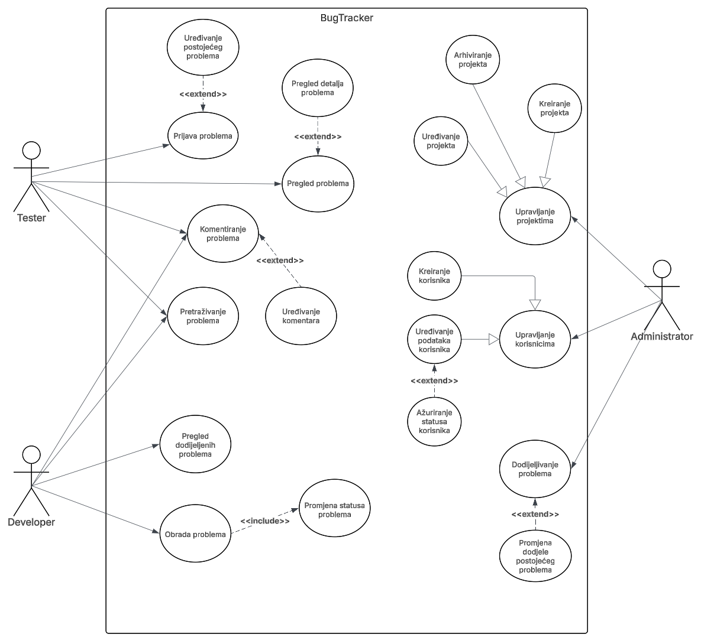
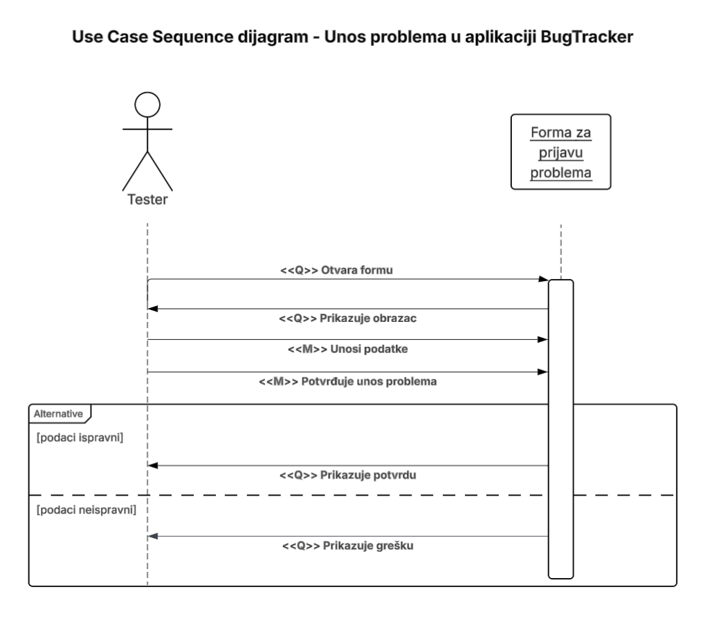
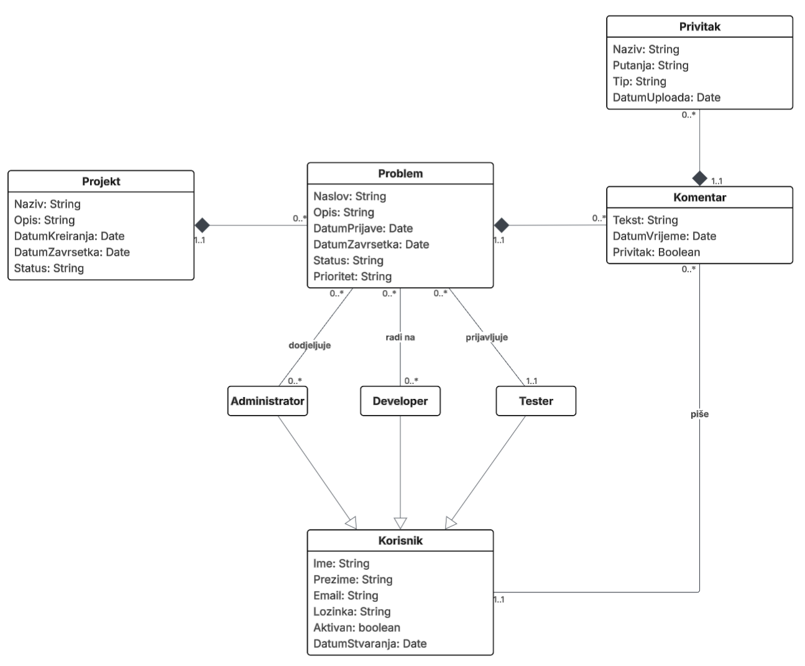

# BugTracker

BugTracker je web aplikacija namijenjena upravljanju greškama/problemima (bugovima) i/ili zadacima unutar softverskih projekata. Aplikacija omogućuje razvojnom timu jednostavno prijavljivanje, praćenje i rješavanje problema tijekom razvoja softvera.

Cilj aplikacije je poboljšati organizaciju rada unutar tima, povećati transparentnost razvoja te olakšati komunikaciju između članova tima.

Aplikacija je razvijena kao projekt za kolegij **Programsko inženjerstvo** te je samostalno izrađena.

[Fakultet informatike u Puli](https://fipu.unipu.hr)

[Programsko inženjerstvo](http://ntankovic.unipu.hr/pi)

Mentor: [doc. dr. sc. Nikola Tanković](https://ntankovic.unipu.hr)

## Funkcionalnosti

- registracija i prijava korisnika
- kreiranje projekata
- prijavljivanje problema (issue)
- dodjeljivanje problema članovima tima
- promjena statusa problema (Open, In Progress, Resolved, Closed)
- komentiranje problema
- pregled svih problema po projektu
- filtriranje problema po statusu, prioritetu i dodijeljenom korisniku

## Uloge korisnika

Sustav podržava više korisničkih uloga:

- **Administrator** – upravlja projektima i korisnicima
- **Developer** – rješava prijavljene probleme
- **Tester / Reporter** – prijavljuje nove probleme

## Tehnologije

Projekt koristi sljedeće tehnologije:

- **Vue.js** – frontend framework
- **Vue Router** – navigacija između stranica
- **Firebase** – backend i baza podataka
- **CSS / Tailwind** – stiliziranje korisničkog sučelja

## Struktura aplikacije

Aplikacija se sastoji od nekoliko glavnih modula:

- upravljanje korisnicima
- upravljanje projektima
- upravljanje problemima
- sustav komentara
- dashboard za pregled stanja projekta

## Cilj projekta

Cilj projekta je demonstrirati primjenu principa **programskog inženjerstva**, uključujući:

- analizu zahtjeva
- dizajn sustava
- razvoj web aplikacije
- upravljanje zadacima i bugovima

## Buduća poboljšanja

- email notifikacije
- napredni sustav filtriranja
- Kanban board
- statistika bugova po projektu

## Use Case dijagram

### Akteri

#### Tester

Tester prijavljuje nove probleme u sustavu, pregledava postojeće probleme, pretražuje ih te može komentirati prijavljene probleme.

#### Developer

Developer pregledava probleme koji su mu dodijeljeni te ih obrađuje mijenjajući njihov status tijekom procesa rješavanja.

#### Administrator

Administrator upravlja projektima i korisnicima unutar sustava te može dodjeljivati probleme developerima.

### Opis dijagrama

Use Case dijagram prikazuje interakciju između aktera (Tester, Developer i Administrator) i funkcionalnosti sustava BugTracker. 

Dijagram prikazuje glavne funkcije sustava kao što su prijava problema, pregled problema, komentiranje problema, obrada problema te upravljanje projektima i korisnicima.

## Use Case Sequence dijagram

Use Case Sequence: Prijava problema

Akter: Tester

Opis:
Tester prijavljuje novi problem u sustavu kako bi developer mogao analizirati i popraviti grešku.

Preduvijet: 
Tester je prijavljen u sustav.

Glavni tok:
1. Tester otvara formu za prijavu problema.
2. Sustav prikazuje obrazac za unos problema.
3. Tester unosi podatke o problemu.
4. Tester potvrđuje unos problema.
5. Sustav provjerava ispravnost podataka.
6. Sustav prikazuje potvrdu o uspješnom spremanju problema.

Alternativni tok:
1. Sustav prikazuje poruku o grešci.
2. Tester ispravlja podatke

Postuvjet:
- Novi problem je evidentiran u sustavu.
- Problem je dostupan developerima za obradu.

## Class model

## Link na javni prototip

[Javni prototip na Figmi](https://www.figma.com/proto/2cuI4zi1EPM0Qb3RuzRjSS/BugTracker?node-id=0-1&t=uJ5pskhX8eYchWpY-1)